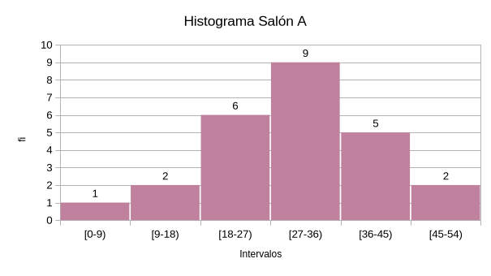

# EST.1.2.1.Ejercicios

#### [Teoria sobre las graficas estadisticas](<./EST.1.2.Graficas Estadisticas.md>)

# 1. Ejercicio 

En la siguiente tabla se muestra los datos de pacientes con problemas dentales de una clínica, se pide elaborar:

1. **Diagrama de barras**

2. **Elaborar un diagrama de torta**

| N°  | Problema       | Pacientes | F   | %fi     | Grados  |
| :---: | :-------------- | :---------: | :---: | :-------: | :-------: |
| 1 | Caries         | 181       | 181 | 24.76%  | 89.14°  |
| 2 | Limpieza       | 179       | 360 | 24.49%  | 88.15°  |
| 3 | Extracción     | 138       | 498 | 18.88%  | 67.96°  |
| 4 | Prótesis       | 94        | 592 | 12.86%  | 46.29°  |
| 5 | Reconstrucción | 58        | 650 | 7.93%   | 28.56°  |
| 6 | Carillas       | 41        | 691 | 5.61%   | 20.19°  |
| 7 | Implantes      | 40        | 731 | 5.47%   | 19.70°  |
|     | Total          | 731       |     | 100.00% | 360.00° |

## 1.1. Respuesta 1 

## 1.2. Respuesta 2  

De acuerdo a la gráfica obtenida, 181 pacientes de los 731 de la muestra presentan problemas de caries, con un 24,76% de incidencia, seguida por problemas de limpieza (24,49%) y extracción (18,88%), lo que indica que la población es recurrente en estos problemas dentales.

# 2. Ejercicio 

El gerente de una compañía registra la vida útil en horas de 60 bombillas eléctricas como se muestran a continuación:

**Calcule:**

1. **La distribución de frecuencias agrupadas con su gráfico.**
2. **¿Cuál hora es más favorable de los intérvalos?**

$$
\begin{matrix}
807&811&620&650&817&732&747&823&844&907 \\
660&753&1050&918&857&867&675&880&878&890 \\
881&872&869&841&847&833&829&827&822&811 \\
766&787&923&792&803&933&947&717&817&753 \\
1056&1076&958&970&776&828&831&781&1088&1082 \\
832&863&852&788&980&889&1030&897&775&891
\end{matrix}
$$

## 2.1. Respuesta 1 

- $A = 1088-620 = 468$
- $\text{\#Clases} = 1+3.33 \log{60} \approx 7$
- $IC = \dfrac {468}{7} = 67$
- $LI = 620$

Se le suma al valor menor el intervalo de clase, en este caso 67

![[EST.1.2.fc.png]]

## 2.2. Respuesta 2 

De acuerdo con la grafica, la hora mas favorable seria entre las 821 y las 888

# 3. Ejercicio

El gerente de una compañía registra el número de unidades de cierto trabajo completadas por lo empleados. 50 empleados realizan el mismo trabajo divididos en 2 grupos de 25 y en salones diferentes. En el salón A el gerente registra el siguiente número de unidades completadas por día.

**Salón A**
 
$$
\begin{matrix} \\
21&22&20&15&25 \\
0&28&9&28&30 \\
24&29&27&34&38 \\
24&35&36&31&41 \\
32&43&44&53&50
\end{matrix}
$$

**Salón B**

$$
\begin{matrix}
6&21&13&36&18 \\
24&32&16&18&20 \\
28&25&33&26&30 \\
26&29&35&45&59 \\
32&31&30&40&30
\end{matrix}
$$

- **1)** Realice el histograma de frecuencia del salón A
- **2)** Combine todos los datos y dibuje el histograma de frecuencias con una amplitud de 4 para cada intervalo

## 3.1. Respuesta 1 

Para el histograma de frecuencias del salón a primero se encuentran los datos para construir la tabla:

### 3.1.1. Amplitud de intérvalos $A$ 

$A= \text{Valor Mayor}-\text{Valor menor}$.

El valor mayor del salón A es 53 y el valor mínimo es 0.

> Tip: En un programa de hoja de cálculo (LibreOffice Calc, OnlyOffice, etc) se puede encontrar el mayor valor con la función =MAX(celda1:celda2) y el minimo con =MIN(celda1:celda2)
$A=53-0=53$

### 3.1.2. # de Clases 

$\text{\#Clases}=1+3,33 \log{N}$

Donde N es la cantidad total de elementos, en este caso trabajadores, el cual en una app de cálculo se consigue con =COUNT(celda1:celda2)

$\text{\#Clases}=1+3.33\log{}{25}\approx 5.65$

Se redondea al siguiente número más cercano

$\text{\#Clases}\approx 6$

### 3.1.3. Intervalo de Clases $IC$
$IC=\dfrac{\text{Amplitud}}{\text{\#Clases}}$
Teniendo amplitud y # Clases el cálculo es directo
$IC=\frac{53}{6}= 8.8\overline{33}$
$IC \approx 6$

### 3.1.4. Límite Inferior de Clase $L_{I}$

Valor menor conseguido a mano o con la función MIN

$L_{I}=0$

$L_{I}=9$
$\vdots$
Se debe calcular el límite inferior para cada clase, así poder conseguir los cálculos de forma correcta.

### 3.1.5. Límite Superior Clase $L_{S}$

$L_{S}=\text{Valor Menor} +\text{Amplitud}$

Al igual que el anterior se calcula para cada clase, se toma como límite abierto, es decir, solo cuentan los valores anteriores a él

$L_{S}=9$

$L_{S}=18$

### 3.1.6. Marca de Clase $x_{i}$ 

$x_{i}=\dfrac{\text{L.S}+\text{L.I}}{2}$

Es un promedio de cada clase, su cálculo es sencillo al ser con valores ya calculados, se realiza para cada clase

$x_{i}=\dfrac{9+0}{2}=4.5$
$\vdots$

### 3.1.7. Tabla y Gráficas

$f_i$ es la frecuencia absoluta

$F$ es la frecuencia absoluta acumulada

| N°  | $IC$    | $LI$ | $LS$ | $f_i$ | $F$ | $x_i$ |
| --- | ------- | ---  | ---  | ---   | --- | ----  |
| 1   | [0-9)   | 0    | 9    | 1     | 1   | 4.5   |
| 2   | [9-18)  | 9    | 18   | 2     | 3   | 13.5  |
| 3   | [18-27) | 18   | 27   | 6     | 9   | 22.5  |
| 4   | [27-36) | 27   | 36   | 9     | 18  | 31.5  |
| 5   | [36-45) | 36   | 45   | 5     | 23  | 40.5  |
| 6   | [45-54) | 45   | 54   | 2     | 25  | 49.5  |
|     | Total   |      |      | 25    |     |       |

### 3.1.8. Promedio de los datos

Se calcula con la fórmula mencionada anteriormente en las notas: $x = \frac{\sum x_i * fi}{\sum N}$
Para realizarlo en una hoja de cálculo se puede usar la función =SUMPRODUCT(celda1:celda2,celda3:celda4), se multiplica celda1 por celda 3 hasta que se termine el rango, también se puede usar con una suma matricial, con la funcion =ARRAYS, o más simple aún con =SUMA(celda1:celda2 * celda3:celda4) y al cerrar el paréntesis usas ctrl + shift + enter.

Promedio de los datos
$x = \frac{\sum x_i * fi}{\sum N}$

$x=125.25$

## 3.2 Respuesta b

$$
\begin{matrix} \\
21&22&20&15&25 \\
0&28&9&28&30 \\
24&29&27&34&38 \\
24&35&36&31&41 \\
32&43&44&53&50 \\
6&21&13&36&18 \\
24&32&16&18&20 \\
28&25&33&26&30 \\
26&29&35&45&59 \\
32&31&30&40&30 
\end{matrix}
$$

Esta es la tabla resultante de combinar todos los datos del salón A y salón B, se realizan los mismos cálculos que en el histograma A, pero con la nueva tabla

$Amplitud = 59$

$IC = 4$  // Dato del ejercicio

### 3.2.1.Tabla y Gráfica

Primero se realiza la tabla para saber el número de clases necesarias para contener a todos los datos.

| N°  | IC      | LI  | LS  | fi  | F   | xi  |
| --- | ------- | --- | --- | --- | --- | --- |
| 1   | [0-4)   | 0   | 4   | 1   | 1   | 2   |
| 2   | [4-8)   | 4   | 8   | 1   | 2   | 6   |
| 3   | [8-12)  | 8   | 12  | 1   | 3   | 10  |
| 4   | [12-16) | 12  | 16  | 2   | 5   | 14  |
| 5   | [16-20) | 16  | 20  | 3   | 8   | 18  |
| 6   | [20-24) | 20  | 24  | 5   | 13  | 22  |
| 7   | [24-28) | 24  | 28  | 8   | 21  | 26  |
| 8   | [28-32) | 28  | 32  | 11  | 32  | 30  |
| 9   | [32-36) | 32  | 36  | 7   | 39  | 34  |
| 10  | [36-40) | 36  | 40  | 3   | 42  | 38  |
| 11  | [40-44) | 40  | 44  | 3   | 45  | 42  |
| 12  | [44-48) | 44  | 48  | 2   | 47  | 46  |
| 13  | [48-52) | 48  | 52  | 1   | 48  | 50  |
| 14  | [52-56) | 52  | 56  | 1   | 49  | 54  |
| 15  | [56-60) | 56  | 60  | 1   | 50  | 58  |
|     | Total   |     |     | 50  |     |     |

Se observa que

$\text{\# de clases}=15$

Y ya se tiene $x_{i}$ para todo elemento en la tabla, por lo que solo resta la gráfica

### 3.2.2. Promedio de los datos

Como último paso, el promedio de todos los datos sería:

$x=98.\overline{66}$
