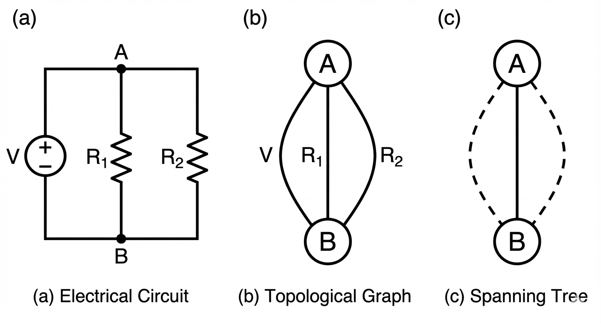

# ELE.1.3. Leyes de Kirchhoff y Conexiones

> [!abstract]- Las Leyes de Kirchhoff
> Una vez definidos los componentes, necesitamos reglas que gobiernen su interconexión. Las Leyes de Kirchhoff no son leyes físicas nuevas, sino consecuencias directas de la conservación de la carga y la conservación de la energía aplicadas a modelos de parámetros concentrados.

---

# 1. Definiciones Topológicas

Antes de aplicar ecuaciones, debemos definir la geometría de la red:
1.  **Nodo**: Punto de conexión de dos o más elementos. Si el cable es ideal ($R=0$), todo el conductor constituye un solo nodo. Se definen como nodos principales a puntos de conexión entre al menos 3 elementos.
2.  **Rama**: Trayectoria única que contiene un elemento simple y conecta dos nodos.
3.  **Lazo (Loop)**: Cualquier trayectoria cerrada que pasa por nodos sin repetir ninguno.
4.  **Malla (Mesh)**: Un lazo que no contiene otros lazos en su interior. Es una propiedad de circuitos planos.
5. **Grafo**: Representación esquemática de la red, mostrando solo nodos y ramas.
6. **Árbol**: Subconjunto del grafo que conecta todos los nodos sin formar lazos.

*A la izquierda el circuito original. Al medio la representación del grafo del circuito, este consta de 3 ramas y 2 nodos. A la derecha la representación del árbol del grafo, solo tiene 1 rama entre los 2 nodos*

## 1.1. Propiedades

Si se tiene un arbol de $r_a$ ramas y $n$ nodos, en un grafo de $r_g$ ramas:
- Ramas del arbol: $r_a = r_g - 1$
- Eslabones (mallas independientes): $r_e = r_g - (n - 1)$

# 2. Leyes de Kirchhoff

### 2.1. Ley de Corrientes de Kirchhoff (LCK)
Basada en la **Conservación de la Carga**. La carga no puede acumularse en un nodo (capacidad nula).
> "La suma algebraica de las corrientes que entran a un nodo es cero".

$$\sum_{n=1}^{N} i_n(t) = 0$$

* **Convención**: Corrientes que SALEN son positivas (+), corrientes que ENTRAN son negativas (-), o viceversa, siempre que se mantenga la consistencia.
* **Generalización**: La LCK también aplica a una "superficie cerrada" o supernodo que encierre parte del circuito.

### 2.2. Ley de Tensiones de Kirchhoff (LTK)
Basada en la **Conservación de la Energía**. El campo eléctrico es conservativo; el trabajo total realizado al mover una carga en una trayectoria cerrada es nulo.
> "La suma algebraica de las tensiones a lo largo de cualquier lazo cerrado es cero".

$$\sum_{m=1}^{M} v_m(t) = 0$$

* **Aplicación Práctica**: Recorremos el lazo en un sentido (ej. horario). Si entramos por el terminal positivo de un elemento, sumamos su tensión ($+v$); si entramos por el negativo, restamos ($-v$).

# 3. Simplificación de Circuitos

### 3.1. Divisor de Tensión (Serie)
Útil para obtener una tensión de referencia menor a partir de una fuente principal.
Dado un circuito con una fuente $V_s$ y $N$ resistencias en serie:
$$v_k = V_s \cdot \frac{R_k}{R_{eq}} \quad \text{donde } R_{eq} = R_1 + R_2 + ... + R_N$$
* **Nota**: Esto solo es válido si **no** se extrae corriente del nodo intermedio (o la corriente extraída es despreciable, alta impedancia).

### 3.2. Divisor de Corriente (Paralelo)
La corriente busca el camino de menor resistencia. Para dos resistencias $R_1$ y $R_2$ en paralelo con una corriente total $I_s$:
$$i_1 = I_s \cdot \frac{R_2}{R_1 + R_2} \quad ; \quad i_2 = I_s \cdot \frac{R_1}{R_1 + R_2}$$
* **Ojo**: En el numerador va la resistencia **opuesta** a la rama que calculamos.
* **Caso General ($N$ resistencias)**: Se usa la conductancia $G$.
    $$i_k = I_s \cdot \frac{G_k}{G_{total}}$$

---

## Resumen
* **Nodos ($n$) y Ramas ($b$)**: Determinan cuántas ecuaciones independientes necesitamos.
* **LCK**: Ecuación de restricción por cada nodo (menos uno, el de referencia).
* **LTK**: Ecuación de restricción por cada malla independiente.

> [!Exercise]- El Divisor de Tensión "Cargado": Tienes un divisor con dos resistencias de $10k\Omega$ alimentado a 10V. En vacío, la salida es 5V. ¿Qué pasa si conectas una carga de $10k\Omega$ a la salida?
> 
> **Respuesta**: La tensión cae a 3.33V.
> **Explicación**: La resistencia inferior ya no es $10k\Omega$, sino $10k || 10k = 5k\Omega$. El nuevo divisor es $\frac{5k}{10k+5k} \cdot 10V \approx 3.33V$. Esto es un error clásico al interconectar etapas lógicas.

## Bibliografía
[**Fraile Mora, J.** - *Circuitos Eléctricos*, Cap. 2]
[**Floyd** - *Fundamentos de Sistemas Digitales*, Cap. 1]